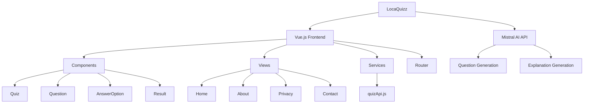
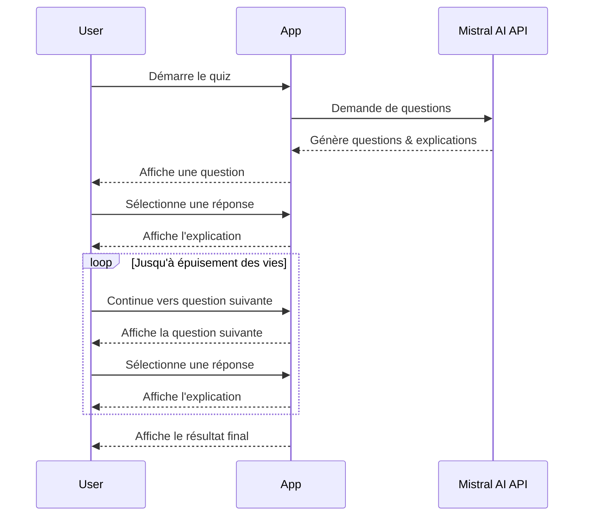

# LocaQuizz 🌱


> **Mange local, pense global… joue intelligent !**  
> Une application éducative pour sensibiliser aux choix alimentaires durables grâce à des quiz générés par IA.

## 📋 Sommaire

- [LocaQuizz 🌱](#locaquizz-)
  - [📋 Sommaire](#-sommaire)
  - [🌿 À propos](#-à-propos)
  - [✨ Fonctionnalités](#-fonctionnalités)
  - [🏗️ Architecture](#️-architecture)
    - [Structure du projet](#structure-du-projet)
    - [Flux de données](#flux-de-données)
  - [🚀 Technologies](#-technologies)
  - [💻 Installation](#-installation)
  - [🚦 Utilisation](#-utilisation)
    - [Mode développement](#mode-développement)
    - [Build pour production](#build-pour-production)
    - [Prévisualiser la build](#prévisualiser-la-build)
  - [🤖 API Mistral](#-api-mistral)
  - [👥 Équipe](#-équipe)
  - [📄 Licence](#-licence)

## 🌿 À propos

LocaQuizz est une application web éducative qui vise à sensibiliser les utilisateurs à l'importance de consommer local et de faire des choix alimentaires durables. Grâce à l'intégration de l'IA (Mistral AI), l'application génère des quiz personnalisés et infinis sur cette thématique, permettant un apprentissage ludique et interactif.

## ✨ Fonctionnalités

- **Quiz infini**: Questions générées à l'infini par l'IA Mistral
- **Système de vies**: 3 vies pour tester vos connaissances
- **Explications détaillées**: Après chaque réponse, découvrez des informations approfondies
- **Responsive design**: Compatible avec tous les appareils
- **Interface intuitive**: Navigation fluide et expérience utilisateur optimisée
- **Statistiques de progression**: Suivez votre taux de réussite

## 🏗️ Architecture

### Structure du projet



### Flux de données



## 🚀 Technologies

- **Frontend**: 
  - Vue.js 3.5.13
  - Vue Router 4.5.1
  - CSS personnalisé (variables CSS)
  
- **Build Tools**:
  - Vite 6.2.4
  
- **API**:
  - Mistral AI API

## 💻 Installation

1. Clonez le dépôt:
```sh
git clone https://github.com/username/locaquizz.git
cd locaquizz
```

2. Installez les dépendances:
```sh
npm install
```

3. Configuration de l'API Mistral AI:
   - Créez un fichier `.env` à la racine du projet
   - Ajoutez votre clé API: `VITE_MISTRAL_API_KEY=votre_clé_api`

## 🚦 Utilisation

### Mode développement

```sh
npm run dev
```

Accédez à l'application via `http://localhost:5173/`

### Build pour production

```sh
npm run build
```

### Prévisualiser la build

```sh
npm run preview
```

## 🤖 API Mistral

L'application utilise Mistral AI pour générer des questions de quiz personnalisées. La configuration se trouve dans `src/services/quizApi.js`.

```js
// Exemple d'appel API
const response = await fetch(MISTRAL_API_URL, {
  method: 'POST',
  headers: {
    'Content-Type': 'application/json',
    'Authorization': MISTRAL_API_TOKEN,
  },
  body: JSON.stringify({
    agent_id: AGENT_ID,
    messages: [
      {
        role: "user", 
        content: `{nb_question: ${nbQuestions}}`
      }
    ]
  })
});
```

## 👥 Équipe

- **Valentin Vanhove** - Chef de projet & Développeur Full-Stack
- **Omar Madjidi** - Développeur Frontend
- **Vincent Altmann** - Ingénieur IA & Data Scientist
- **Alexandre Giordana** - UX/UI Designer
- **Gilchrist Laleye** - Développeur Backend
- **Theo Fratia** - Spécialiste en durabilité
- **Gael Pidoux** - Responsable marketing

## 📄 Licence

Ce projet est sous licence MIT - voir le fichier LICENSE pour plus de détails.

---

&copy; 2025 LocaQuizz - Pour une alimentation responsable et durable
